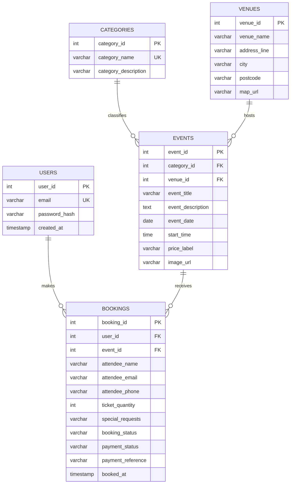

# Bristol Buzz Week 2 Database Design

## ERD in 3NF

## Relationships and Multiplicities

- One category can classify many events; each event belongs to one category.
- One venue can host many events; each event is hosted at one venue.
- One user can make many bookings; each booking belongs to one user.
- One event can receive many bookings; each booking belongs to one event.

The design is in 3NF because each table has a primary key, non-key attributes describe only that key, repeated groups are removed, partial dependencies are removed, and transitive dependencies such as venue address and category description are held in their own tables.

## Normalisation Examples

### Example 1: Events Listing

Unnormalised form:

| EventTitle | Category | VenueName | VenuePostcode | Date | StartTime |
| --- | --- | --- | --- | --- | --- | --- | --- |
| International Balloon Fiesta | Family Friendly | Ashton Court Estate | BS41 9JN | 2026-08-08 | 06:00 |
| Great Bristol Half Marathon | Sport | Millennium Square | BS1 5SZ | 2026-05-10 | 09:00 |

1NF:

- Each field contains one value only.
- Repeating event details are separated into rows.

2NF:

- Event data is stored in `events`.
- Category data is moved into `categories`.
- Venue data is moved into `venues`.

3NF:

- `events` stores `category_id` and `venue_id` only.
- Venue postcode depends on `venue_id`, not on the event.
- Category description depends on `category_id`, not on the event.

### Example 2: Booking Form Data

Unnormalised form:

| Email | Password | EventName | EventDate | VenueName | TicketQuantity | BookingStatus | PaymentStatus |
| --- | --- | --- | --- | --- | --- |
| student@example.com | secret123 | Great Bristol Half Marathon | 2026-05-10 | Millennium Square | 1 | confirmed | accepted |
| student@example.com | secret123 | Love Saves The Day | 2026-05-23 | Bristol Harbourside | 2 | confirmed | accepted |

1NF:

- Each booking is stored as a separate row.
- No cell contains a list of events.

2NF:

- User account details are moved into `users`.
- Event details are moved into `events`.
- Booking details are moved into `bookings`.

3NF:

- `bookings` stores foreign keys: `user_id` and `event_id`.
- Ticket holder details, ticket quantity, booking status, and payment status depend on `booking_id`.
- User email and password hash depend only on `user_id`.
- Event date and venue depend only on `event_id`.
- Venue address depends only on `venue_id`.

## MySQL Implementation

The MySQL implementation is in `database_schema.sql`. It creates the complete `bristol_buzz` database with primary keys, foreign keys, uniqueness rules, and seed data that maps directly to the ERD.
